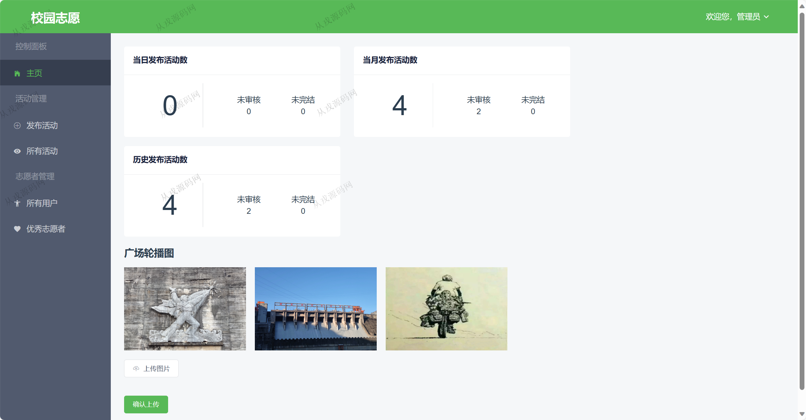
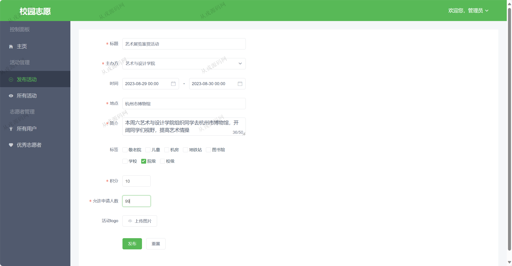
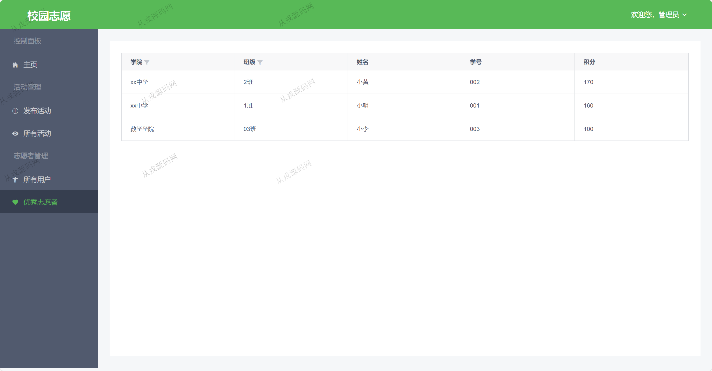
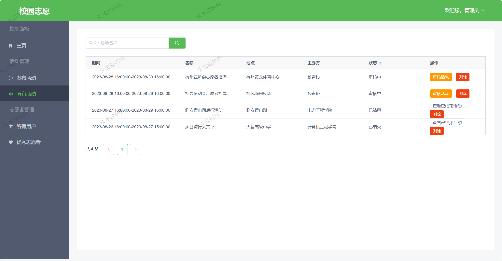
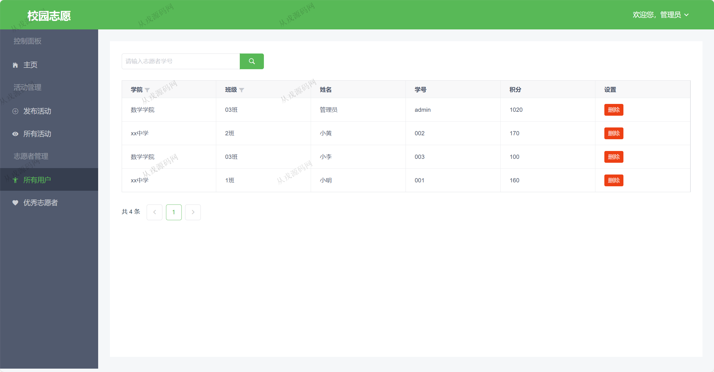
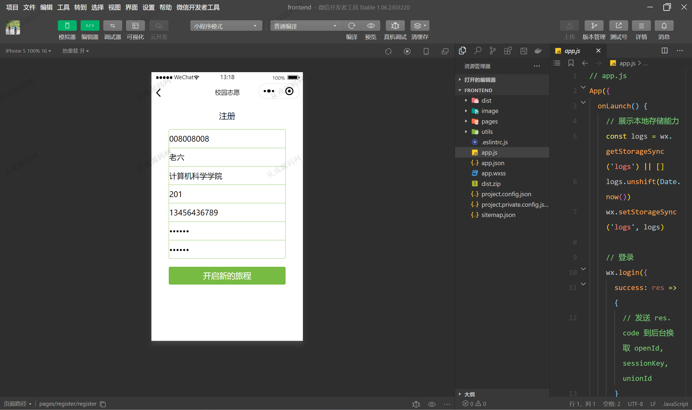
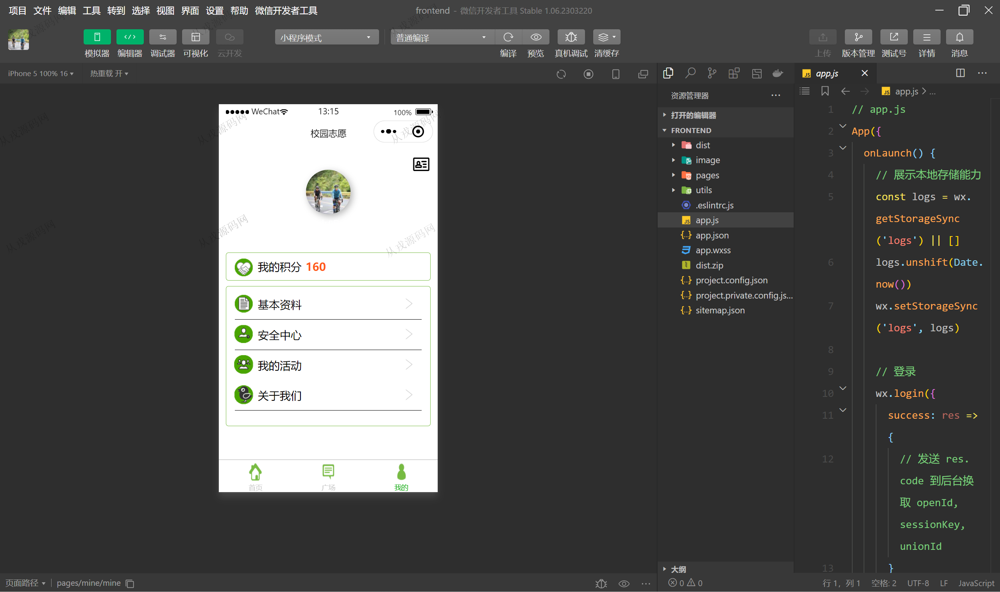
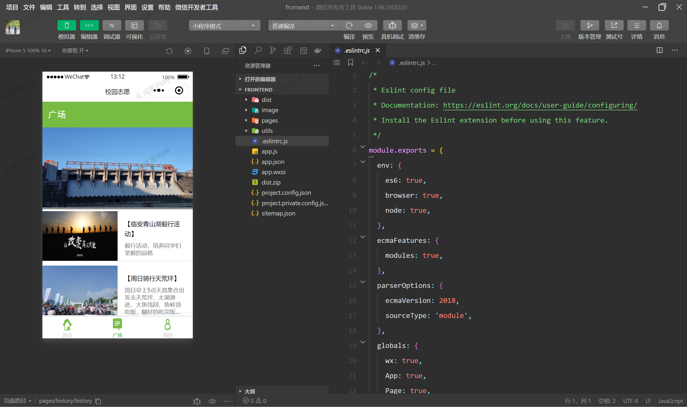
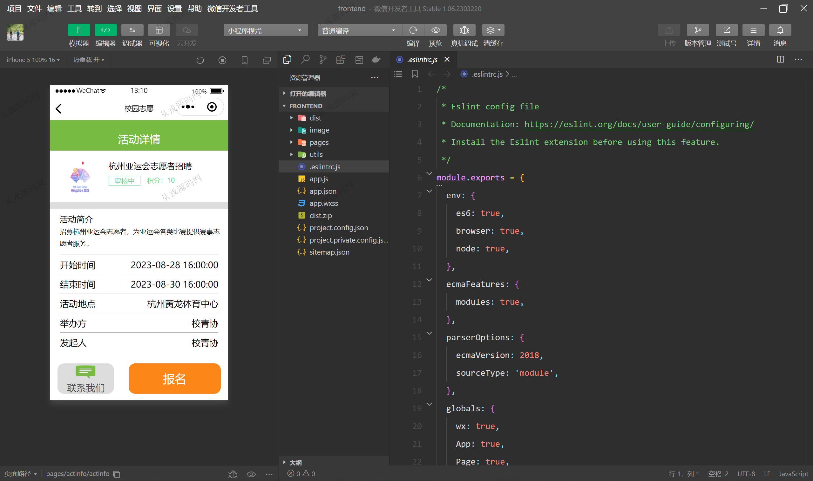
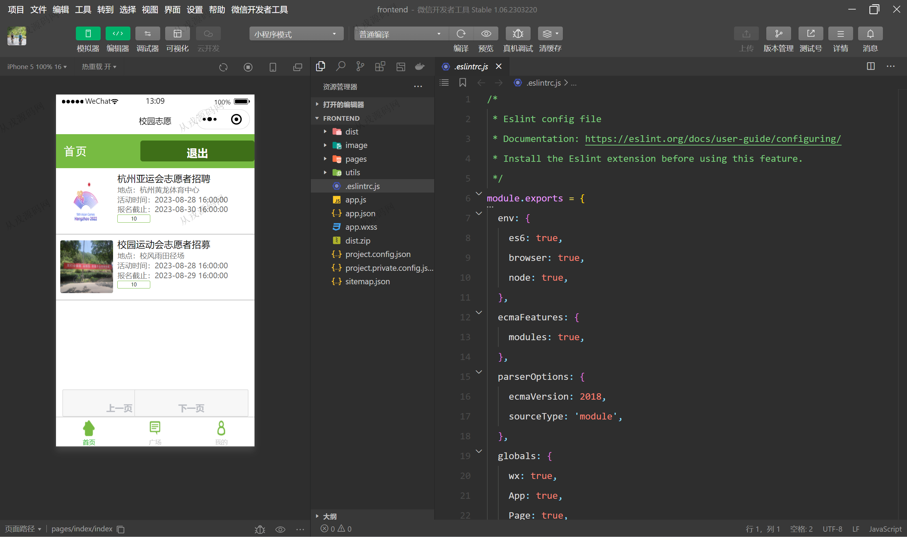

<h1 align="center">83.志愿者活动管理系统</h1>

- <b>完整代码获取地址：从戎源码网 ([https://armycodes.com/](https://armycodes.com/))</b>
- <b>技术探讨、资料分享，请加QQ群：692619798</b> 
- <b>作者微信：19941326836  QQ：952045282</b> 
- <b>承接计算机毕业设计、Java毕业设计、Python毕业设计、深度学习、机器学习</b>
- <b>选题+开题报告+任务书+程序定制+安装调试+论文+答辩ppt 一条龙服务</b>
- <b>所有选题地址 ([https://github.com/YuLin-Coder/AllProjectCatalog](https://github.com/YuLin-Coder/AllProjectCatalog)) </b>

## 项目介绍
基于小程序的志愿者活动管理系统：前端 Vue、Vuex、Axios、小程序，后端 Spring、SpringBoot、Redis、mybatis，角色分为管理员、志愿者；集成活动发布、志愿者管理、报名等功能于一体的系统。

## 功能介绍

### 志愿者
- 基本操作：登录、注册、修改个人信息、修改密码、查看基本资料、查看我的积分
- 活动模块：获取活动列表、查看活动详情、我的活动、报名活动、评论活动、获取轮播图

### 管理员：
- 基本操作：注册、登录、
- 活动模块：发布活动、获取活动列表、编辑活动、删除活动、筛选活动
- 统计模块：每日发布活动数、当月发布活动数、历史发布活动数
- 志愿者管理：查看志愿者列表、查看优秀志愿者、查看志愿者相关积分、删除志愿者、筛选志愿者
- 轮播图管理：上传广场轮播图

## 环境

- <b>IntelliJ IDEA 2021.3</b>

- <b>Mysql 5.7.26</b>

- <b>JDK 1.8</b>

- <b>maven 3.2.5</b>

- <b>redis 3.0</b>

- <b>node 14.14.0</b>

- <b>微信开发者工具 </b>

## 运行截图

